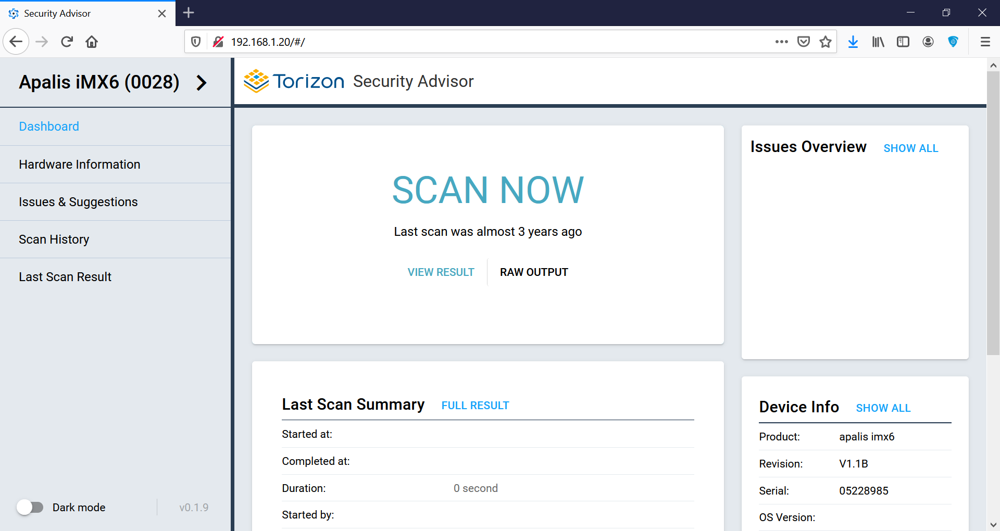
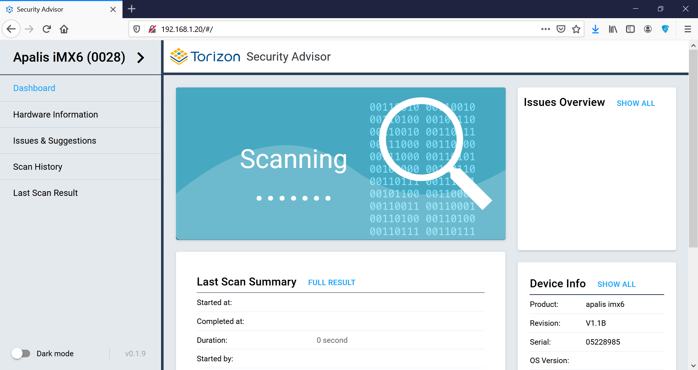
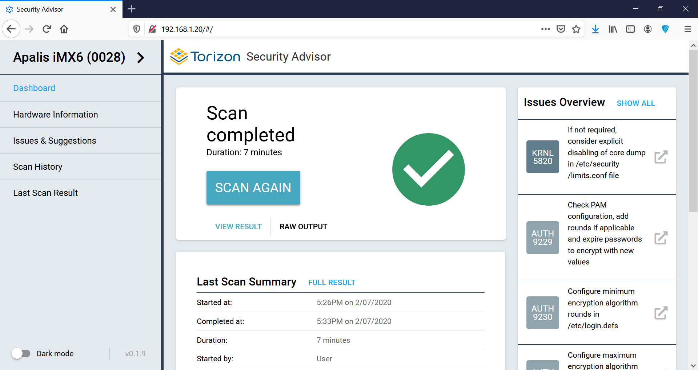
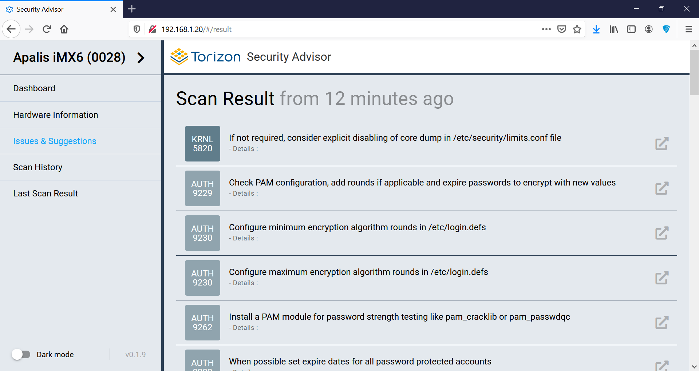

# Table of Contents #

1. [Introduction](#Introduction)
2. [Getting the SAT](#Getting-the-SAT)
3. [Starting a SAT Container](#Starting-a-SAT-Container)
4. [Using the SAT](#Using-the-SAT)
    1. [Web Interface](Web-Interface)
5. [API Endpoints](#API-Endpoints)


# Introduction #

The Security Advisory Tool (SAT) is a containerized tool that is a part of the Torizon platform, namely Torizon’s pledge towards security practices and awareness. The main objective of this tool is to make users of Torizon aware of their security situation. This in turn will allow these users to make informed decisions and changes to their Torizon system based on this knowledge. 

What this tool is not, is a professional-grade audit or a replacement for an actual security expert. Users should be aware that this tool will point common/major issues but it’s not an all encompassing thorough audit. 

# Getting the SAT #

Currently the SAT is available pre-built as a Docker container image via Dockerhub registry here:

- [https://hub.docker.com/r/toradexlabs/arm32v7-security-advisor](https://hub.docker.com/r/toradexlabs/arm32v7-security-advisor)
- [https://hub.docker.com/r/toradexlabs/arm64v8-security-advisor](https://hub.docker.com/r/toradexlabs/arm64v8-security-advisor)
- [https://hub.docker.com/r/toradexlabs/x86-security-advisor](https://hub.docker.com/r/toradexlabs/x86-security-advisor)

There are 3 flavors of the SAT available here, separated by tag. Whichever you choose depends on the architecture of the machine where you want the SAT to run. Other than computing architecture all 3 versions of the SAT are identical.

- `arm32v7`: You want to run the SAT directly on the 32-bit Toradex SoM you intend to scan (i.e. i.MX6/i.MX7)

- `arm64v8`: You wan to run the SAT directly on a 64-bit Toradex SoM you intend to scan (i.e. i.MX8/i.MX8X)

- `x86`: You want to run the SAT on a development PC, and from there remotely scan your target Toradex SoM

Once you’ve decided you can then perform a `docker pull` on the respective device.

# Starting a SAT Container #

Now whichever method you chose, you should now have a SAT container image. On whatever device you have the container image you should also copy the below `docker-compose.yml`. This file while not required makes it easier to launch and manage the SAT.

```
version: "2.4"
services:
  sat:
    image: <SAT IMAGE NAME>
    environment:
       - SSHPASS=<USER PASSWORD>
       - USER=<SSH USER>
       - IP=<TARGET DEVICE IP>
    volumes:
       # - ./data:/home/data # uncomment this line if you wish to keep history data across container restart.
    network_mode: "host"
```

Within the file you’ll notice 4 variables which you’ll need to set before you can start the tool.

- `image`: The container image name for whatever variant of the SAT you want to run. For more information on the SAT variants see the section above.

- `SSHPASS`: The password for TorizonCore user on the device you want to target

- `USER`: A user with SSH capabilities that is present on the TorizonCore device you want to target.

- `IP`: The IP address of the TorizonCore device you want to target, if you’re running the SAT directly on the target TorizonCore device itself then simply just use the localhost (127.0.0.1).

Finally there’s also the following commented out line in the file: `- # ./data:/home/data # uncomment this line if you wish to keep history data across container restart.`

If you want a persistent scan history you’ll need to un-comment the first part of this line. As you can see by the bindmount it looks for a `data` directory in your current directory, current being whatever directory you start the container in. So in addition to un-commenting this line make sure to also create this `data` directory on the machine that starts this container. Or optionally configure this bindmount to wherever you want to store the scan history on your machine.

Once you’ve configured the container settings to your liking then you are now free to start the tool.

Once you’ve started the container you should see the following output to confirm that it is running:

```
* Serving Flask app "main" (lazy loading)
* Environment: production
  WARNING: This is a development server. Do not use it in a production deployment.
  Use a production WSGI server instead.
* Debug mode: on
* Running on http://0.0.0.0:8810/ (Press CTRL+C to quit)
``` 
**NOTE**: If you’re running the SAT container on a Windows PC then the `--network=host` argument will not work instead replace this with a port mapping like `-p 8810:8810`. Also in Windows you’ll need to configure docker-desktop to allow access to bindmount your `data` directory.

# Using the SAT #

## Web Interface ##

Once the container is up and running, open a browser on your PC (if running the SAT on a Toradex device make sure the device is on the same network as your PC) and direct it to `<IP of machine running the SAT>:8810`. This should bring you to the main dashboard page of the SAT’s web UI.



On the left pane you can see several pages which are fairly self-explanatory in what they do. Starting off you should probably run an initial scan since the tool is pretty bare with no scan data to display. You can start a scan by clicking the big “SCAN NOW” on the dashboard page. There should then be a graphic to show that the scan has started and is in progress. The scan can take some time so be patient. 



Once the scan is done you’ll then see the following graphic change to reflect the scan is done. Also you should now notice some information on the page populated with the latest scan information.



Probably the most important page to look at after a scan is the “Issues & Suggestions” page. This page will present a list of all issues and suggested changes that could be made to harden the system.



As a reminder your scan history is saved via bindmount on your host machine in the `data` directory (or wherever you configured it to). If you wish to clear your scan history you can either clear it via the web UI or by just simply clearing this directory and restarting the container.
 
# API Endpoints #

The tool also has a list of REST API type endpoints that can be interacted with directly. For more information on these endpoints and their values see the document here: [Tool API](./ToolAPI.md).